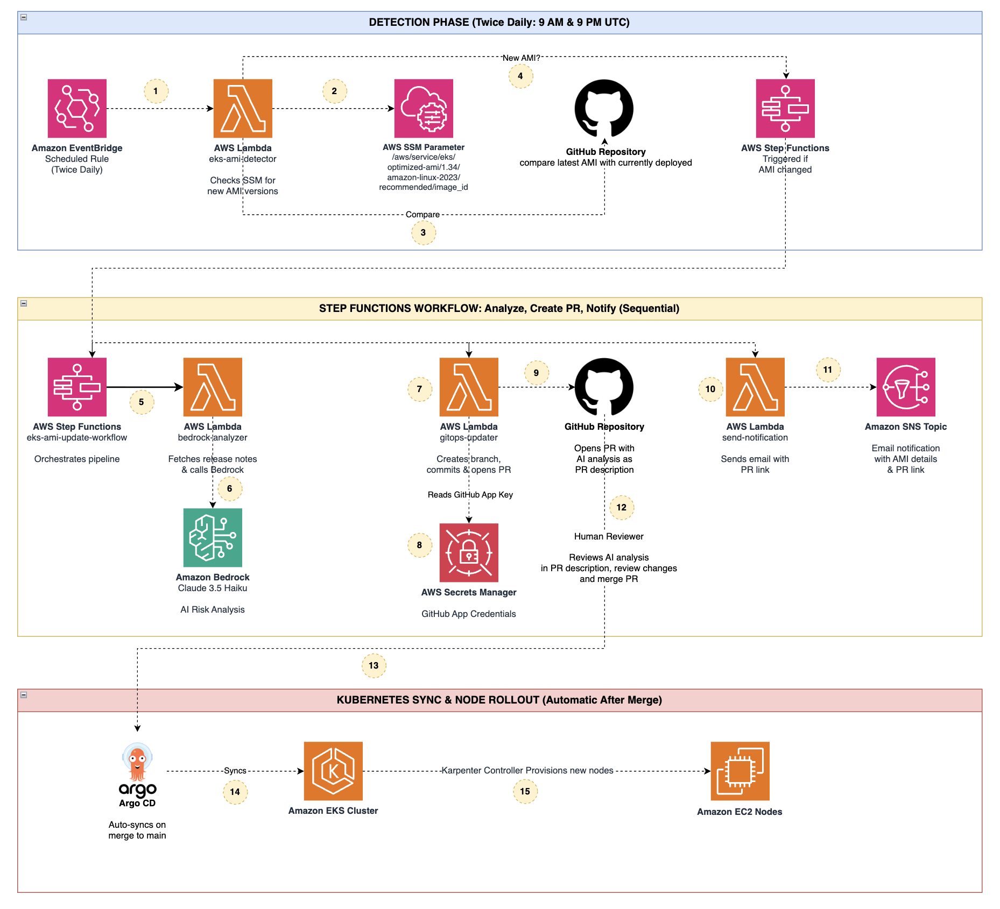

# Building an AI-Powered Event-Driven Amazon Elastic Kubernetes Service (Amazon EKS) AMI Update with GitOps and Karpenter

An intelligent, fully automated pipeline for detecting, analyzing, and deploying new Amazon EKS AMI releases using AI-powered analysis, GitHub pull request review, and GitOps automation.

## Overview

This solution automates the entire Amazon EKS AMI update lifecycle:
- **Automated Detection**: Polls AWS Systems Manager (SSM) Parameter Store twice daily for new Amazon EKS AMI releases
- **AI Analysis**: Amazon Bedrock (Claude 3.5 Haiku) evaluates CVEs, compatibility, and risk with content filtering guardrails
- **Pull Request Review**: Opens a GitHub PR with AI-generated analysis as the PR description for human review
- **Email Notification**: Sends a notification email with AI analysis summary and a link to the PR
- **GitOps Automation**: Merging the PR triggers Argo CD to sync changes and Karpenter to roll out new nodes

## Architecture



## Key Features

- **Event-Driven**: Automated detection of new Amazon EKS AMI releases via twice-daily polling
- **AI-Powered with Guardrails**: Amazon Bedrock analyzes security patches, CVEs, and compatibility with content filtering guardrails for prompt injection and harmful content
- **Pull Request Workflow**: AI analysis included in the PR description — reviewers see risk score, recommendation, changelog summary, and review guidance directly in GitHub
- **GitHub-Native Approval**: Merging the PR is the approval. GitHub branch protection enforces required reviewers, and the merge audit trail is built into Git
- **Email Notification**: Amazon Simple Notification Service (Amazon SNS) email with AI analysis summary (risk score, recommendation) and a direct link to the PR for review
- **Human Oversight**: No changes reach the main branch without a human merging the PR
- **GitOps Native**: All changes tracked in Git with full audit trail
- **Near-Zero Downtime**: Karpenter gracefully replaces nodes with rolling updates
- **Concurrency Controls**: All AWS Lambda (Lambda) functions configured with reserved concurrent executions
- **Git as Source of Truth**: The detector compares the latest SSM Parameter Store AMI against the currently deployed AMI in Git — no separate database needed. If a PR is closed without merging, the next detection cycle will re-detect the change
- **Single Stack Deploy**: One AWS CloudFormation (CloudFormation) template deploys the entire pipeline

## Workflow
The numbered steps below correspond to the architecture diagram above.

**Detection Phase (Twice Daily: 9 AM & 9 PM UTC)**
1. **Amazon EventBridge (EventBridge) → Detector Lambda** — EventBridge scheduled rule triggers the `eks-ami-detector` Lambda function
2. **Detector Lambda → SSM Parameter Store** — Detector reads the latest Amazon EKS AMI ID from `/aws/service/eks/optimized-ami/...`
3. **Detector Lambda → GitHub** — Detector reads the currently deployed AMI ID from the Karpenter nodeclass YAML in the GitHub repository and compares it with the latest AMI
4. **Detector Lambda → AWS Step Functions (Step Functions)** — If the AMIs differ (new AMI detected), the detector starts the Step Functions workflow

**Step Functions Workflow: Analyze → Create PR → Notify (Sequential)**

5. **Step Functions → Bedrock Analyzer Lambda** — Step Functions invokes the `eks-ami-amazon-bedrock-analyzer` Lambda function
6. **Bedrock Analyzer Lambda → Amazon Bedrock** — Analyzer fetches release notes from GitHub and sends AMI details to Amazon Bedrock (Claude 3.5 Haiku) with Guardrail content filtering for AI risk analysis
7. **Step Functions → GitOps Updater Lambda** — Step Functions invokes the `eks-ami-gitops-updater` Lambda function
8. **GitOps Updater Lambda → AWS Secrets Manager (Secrets Manager)** — Updater reads the GitHub App private key from Secrets Manager and generates a short-lived installation token
9. **GitOps Updater Lambda → GitHub** — Updater creates a feature branch, commits the updated AMI ID, and opens a pull request with the AI analysis as the PR description
10. **Step Functions → Send Notification Lambda** — Step Functions invokes the `eks-ami-send-notification` Lambda function
11. **Send Notification Lambda → SNS Topic** — Notification function publishes an email via SNS with the AI analysis summary and a direct link to the PR

**Kubernetes Sync & Node Rollout (Automatic After Merge)**

12. **Human Reviewer → GitHub** — Reviewer reads the AI analysis in the PR description, reviews the YAML diff, and merges the PR
13. **GitHub → Argo CD** — Argo CD detects the merge to main and auto-syncs the change
14. **Argo CD → EKS Cluster** — Argo CD applies the updated EC2NodeClass to the cluster
15. **Karpenter → EC2 Nodes** — Karpenter provisions new nodes with the updated AMI and gracefully drains old nodes (rolling update)

**Data Classification**
- **AMI metadata**: AMI IDs and SSM Parameter Store parameter paths (non-sensitive)
- **AI analysis output**: Amazon Bedrock-generated risk assessments filtered through content guardrails (non-sensitive, advisory only)
- **GitHub credentials**: GitHub App private key stored encrypted in Secrets Manager; short-lived installation tokens generated on each invocation (sensitive)

No customer workload data, PII, or application data flows through this pipeline.

## Prerequisites

- AWS account with appropriate permissions
- Amazon EKS cluster with Karpenter and Argo CD installed
- Argo CD Application for Karpenter configs pointing to the GitHub repository with **automatic sync enabled** (the GitOps function opens a PR, and after merge Argo CD should auto-sync to apply changes to the cluster)
- GitHub repository with the Karpenter EC2NodeClass YAML already committed at the path you will specify in `GitHubFilePath`. The detector compares the latest AMI in SSM Parameter Store against the AMI in this file — if they differ, it triggers the workflow. To test immediately, commit the file with an older (N-1) AMI ID so the first run detects a change and opens a PR
- GitHub App installed on the target repository with `Contents: Read & write` and `Pull requests: Read & write` permissions. See [GitHub App Setup](#github-app-setup) below for step-by-step instructions
- GitHub branch protection on `main` branch (require PR reviews before merging)
- Amazon Bedrock access (Claude 3.5 Haiku auto-enables on first invocation in commercial regions)

## Quick Start

### 1. Clone Repository

```bash
git clone https://github.com/<your-github-org>/eks-ami-update.git
cd eks-ami-update
```

### 2. Set Up GitHub App

Instead of a Personal Access Token, this solution uses a GitHub App for authentication. GitHub Apps provide scoped permissions, short-lived tokens, and are not tied to a user account.

1. Go to **GitHub Settings → Developer settings → GitHub Apps → New GitHub App**
2. Fill in:
   - **GitHub App name**: `eks-ami-updater` (or any unique name)
   - **Homepage URL**: your repo URL
   - **Webhook**: uncheck "Active" (not needed)
3. Set **Repository permissions**:
   - `Contents`: Read & write
   - `Pull requests`: Read & write
4. Set **Where can this GitHub App be installed?**: "Only on this account"
5. Click **Create GitHub App**
6. Note the **App ID** from the app's General page
7. Scroll down and click **Generate a private key** — a `.pem` file downloads
8. Go to **Install App** (left sidebar) → Install on your repository
9. After installation, note the **Installation ID** from the URL: `https://github.com/settings/installations/<INSTALLATION_ID>`
10. Base64-encode the private key for safe transport into CloudFormation:

```bash
base64 -i your-app-name.private-key.pem | tr -d '\n'
```

### 3. Configure GitHub Branch Protection

Before deploying, enable branch protection on your target repository to prevent direct pushes:

1. Go to your GitHub repository → Settings → Branches → Add rule
2. Branch name pattern: `main`
3. Enable:
   - ✅ Require a pull request before merging
   - ✅ Require approvals (1 or more)
   - ✅ Do not allow bypassing the above settings

This ensures the GitHub App cannot push directly to `main` — it can only create branches and open PRs.

### 4. Deploy with CloudFormation

The CloudFormation template deploys the entire pipeline in a single stack:

```bash
aws cloudformation create-stack \
  --stack-name eks-ami-update \
  --template-body file://cloudformation-template.yaml \
  --capabilities CAPABILITY_NAMED_IAM \
  --parameters \
    ParameterKey=NotificationEmail,ParameterValue=your-email@example.com \
    ParameterKey=GitHubAppId,ParameterValue=123456 \
    ParameterKey=GitHubAppInstallationId,ParameterValue=78901234 \
    ParameterKey=GitHubAppPrivateKey,ParameterValue=$(base64 -i your-app.private-key.pem | tr -d '\n') \
    ParameterKey=GitHubRepoOwner,ParameterValue=your-github-org \
    ParameterKey=GitHubRepoName,ParameterValue=eks-ami-update \
    ParameterKey=GitHubFilePath,ParameterValue=karpenter-configs/clusters/your-cluster/nodeclass.yaml \
    ParameterKey=GitHubBranch,ParameterValue=main \
    ParameterKey=EKSVersion,ParameterValue=1.34
```

**Confirm the SNS subscription** by clicking the link in the confirmation email sent to the specified address.

### 5. Test the Pipeline

Invoke the detector function to trigger the full workflow:

```bash
aws lambda invoke \
  --function-name eks-ami-detector \
  --payload '{}' \
  --cli-binary-format raw-in-base64-out \
  /tmp/response.json && cat /tmp/response.json
```

On first run, if the AMI in SSM Parameter Store differs from the AMI in the Git file, the detector starts the Step Functions workflow, opens a GitHub PR, and sends a notification email.

### 6. Review and Merge the PR

1. Check your email for the notification with the AI analysis and PR link
2. Open the PR in GitHub — the description contains the full Amazon Bedrock analysis
3. Review the YAML diff (AMI ID change)
4. Merge the PR to apply the update

### 7. Verify Argo CD Auto-Sync

After merging, verify Argo CD picks up the change:

```bash
kubectl get application karpenter-nodeclass -n argocd -o jsonpath='{.spec.syncPolicy}'
kubectl get ec2nodeclass default -o yaml | grep ami-
```

### What Gets Deployed

The CloudFormation template creates:

| Resource | Description |
|----------|-------------|
| Secrets Manager Secret | GitHub App credentials storage |
| SNS Topic + Subscription | Email notifications |
| 5 AWS Identity and Access Management (IAM) Roles | Per-function Lambda roles and Step Functions role |
| 4 Lambda Functions | Detector, Amazon Bedrock analyzer, notification sender, GitOps updater |
| Amazon Bedrock Guardrail | Content filtering for AI analysis |
| Step Functions State Machine | Orchestrates the workflow (Analyze → Create PR → Notify) |
| EventBridge Rule | Twice-daily AMI polling schedule |

### CloudFormation Parameters

| Parameter | Required | Default | Description |
|-----------|----------|---------|-------------|
| NotificationEmail | Yes | - | Email for AMI update notifications |
| GitHubAppId | Yes | - | GitHub App ID (from app's General settings) |
| GitHubAppInstallationId | Yes | - | GitHub App Installation ID |
| GitHubAppPrivateKey | Yes | - | GitHub App private key (PEM, base64-encoded) |
| GitHubRepoOwner | Yes | - | GitHub repository owner |
| GitHubRepoName | Yes | - | GitHub repository name |
| GitHubFilePath | Yes | - | Path to Karpenter nodeclass YAML |
| GitHubBranch | No | main | Base branch for pull requests |
| EKSVersion | No | 1.34 | Amazon EKS version to monitor |
| PollingSchedule | No | cron(0 9,21 * * ? *) | EventBridge cron schedule |

## Monitoring

### Check Step Functions Execution

```bash
aws stepfunctions list-executions \
  --state-machine-arn $(aws cloudformation describe-stacks \
    --stack-name eks-ami-update \
    --query 'Stacks[0].Outputs[?OutputKey==`StateMachineArn`].OutputValue' \
    --output text)
```

### Check Lambda Logs

```bash
aws logs tail /aws/lambda/eks-ami-detector --follow
aws logs tail /aws/lambda/eks-ami-amazon-bedrock-analyzer --follow
aws logs tail /aws/lambda/eks-ami-gitops-updater --follow
```


### Check Argo CD Sync

```bash
kubectl get application karpenter-nodeclass -n argocd
kubectl get ec2nodeclass default -o yaml | grep ami-
```

## Security

This solution follows the [AWS Shared Responsibility Model](https://aws.amazon.com/compliance/shared-responsibility-model/). AWS is responsible for security *of* the cloud (infrastructure, managed services), and customers are responsible for security *in* the cloud (configuration, access control, data protection) for resources deployed by this template.

### Security Controls Implemented

- **GitHub App Authentication**: Uses a GitHub App with scoped repository permissions instead of a Personal Access Token. The App generates short-lived installation tokens (1-hour expiry) on each invocation, eliminating long-lived credentials. The App can create branches and open PRs but cannot push directly to the main branch. Actions appear as the App identity, not a user account
- **AI Content Filtering**: Amazon Bedrock Guardrail with content filters for harmful categories (sexual, violence, hate, insults, misconduct) and prompt injection detection
- **IAM Least Privilege**: Each Lambda function has a dedicated IAM role with only the permissions it requires. No shared roles or wildcard resource ARNs (except `bedrock:InvokeModel` which requires `Resource: '*'` for cross-region inference profiles per [AWS documentation](https://docs.aws.amazon.com/service-authorization/latest/reference/list_amazonbedrock.html))
- **Secrets Encryption**: GitHub App private key stored in Secrets Manager, encrypted at rest using AWS-managed keys. Short-lived installation tokens are generated per invocation and never persisted
- **Concurrency Controls**: All Lambda functions configured with reserved concurrent executions to prevent runaway invocations
- **Step Functions Security**: Step Functions state machine uses a dedicated IAM role with least-privilege permissions scoped to invoke only the required Lambda functions
- **EventBridge Security**: EventBridge scheduled rule restricted to invoke only the detector Lambda function via resource-based policy
- **SSM Parameter Store Access**: Detector function IAM role scoped to read-only access for `/aws/service/eks/optimized-ami/*` parameters only
- **Audit Trail**: All AMI changes tracked in Git commit history and PR merge records with timestamps and reviewer identity
- **AI Human-in-the-Loop**: Amazon Bedrock provides risk analysis, but a human reviewer must explicitly merge the PR before any changes are applied
- **Transport Security**: All AWS SDK calls use TLS. GitHub API calls use HTTPS

### Customer Responsibilities

- Configure GitHub branch protection rules on the target repository (require PR reviews)
- Secure the GitHub App private key and restrict App installation to required repositories only
- Manage GitHub repository access — control who can review and merge PRs
- Protect access to the notification email account used for update notifications
- Review and validate IAM permissions align with organizational security requirements
- Secure the Amazon EKS cluster, Argo CD, and Karpenter installations
- Review AI-generated recommendations critically — Amazon Bedrock analysis is advisory, not deterministic

### Production Hardening

For production deployments, consider:
- Customer-managed AWS Key Management Service (AWS KMS) keys for Secrets Manager and SNS encryption
- Lambda Amazon Virtual Private Cloud (Amazon VPC) placement if accessing private resources
- CloudWatch alarms for failed workflow executions
- Lambda dead-letter queues for failed invocations
- GitHub App installation scoped to a single repository

## Configuration

### Update Target Amazon EKS Version

Update the stack with a new Amazon EKS version:

```bash
aws cloudformation update-stack \
  --stack-name eks-ami-update \
  --use-previous-template \
  --capabilities CAPABILITY_NAMED_IAM \
  --parameters \
    ParameterKey=EKSVersion,ParameterValue=1.35 \
    ParameterKey=NotificationEmail,UsePreviousValue=true \
    ParameterKey=GitHubAppId,UsePreviousValue=true \
    ParameterKey=GitHubAppInstallationId,UsePreviousValue=true \
    ParameterKey=GitHubAppPrivateKey,UsePreviousValue=true \
    ParameterKey=GitHubRepoOwner,UsePreviousValue=true \
    ParameterKey=GitHubRepoName,UsePreviousValue=true \
    ParameterKey=GitHubFilePath,UsePreviousValue=true
```

### Change Polling Frequency

```bash
aws cloudformation update-stack \
  --stack-name eks-ami-update \
  --use-previous-template \
  --capabilities CAPABILITY_NAMED_IAM \
  --parameters \
    ParameterKey=PollingSchedule,ParameterValue="rate(6 hours)" \
    ParameterKey=NotificationEmail,UsePreviousValue=true \
    ParameterKey=GitHubAppId,UsePreviousValue=true \
    ParameterKey=GitHubAppInstallationId,UsePreviousValue=true \
    ParameterKey=GitHubAppPrivateKey,UsePreviousValue=true \
    ParameterKey=GitHubRepoOwner,UsePreviousValue=true \
    ParameterKey=GitHubRepoName,UsePreviousValue=true \
    ParameterKey=GitHubFilePath,UsePreviousValue=true
```


## Rollback

### Close the PR

If the AMI update should not be applied, simply close the PR in GitHub without merging.

### Git Revert (After Merge)

```bash
cd karpenter-configs
git revert HEAD
git push
# Argo CD should automatically sync the revert
```

### Manual Node Replacement

```bash
kubectl drain <node-name> --ignore-daemonsets --delete-emptydir-data
kubectl delete node <node-name>
```

## Cleanup

Delete the CloudFormation stack to remove all resources:

```bash
aws cloudformation delete-stack --stack-name eks-ami-update
```

## License

Copyright 2026 Amazon.com, Inc. or its affiliates. All Rights Reserved.

SPDX-License-Identifier: MIT-0
